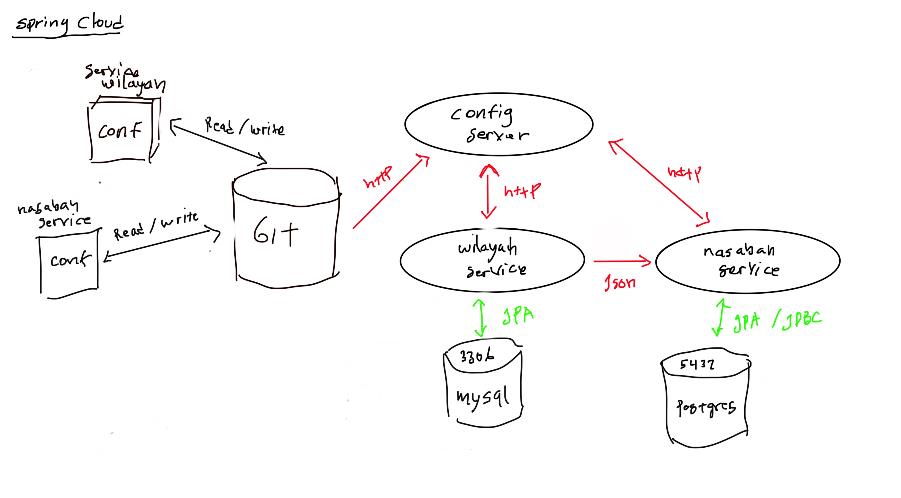
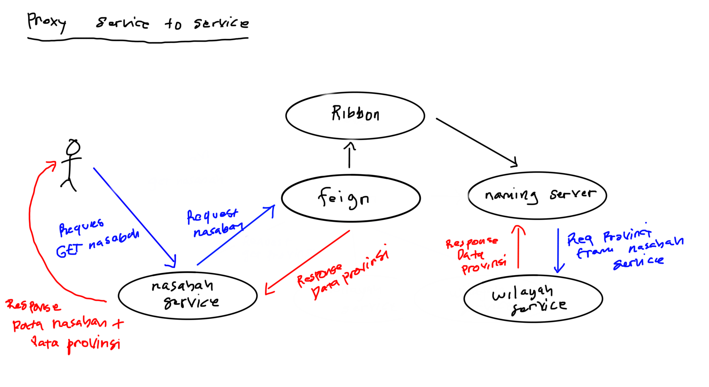
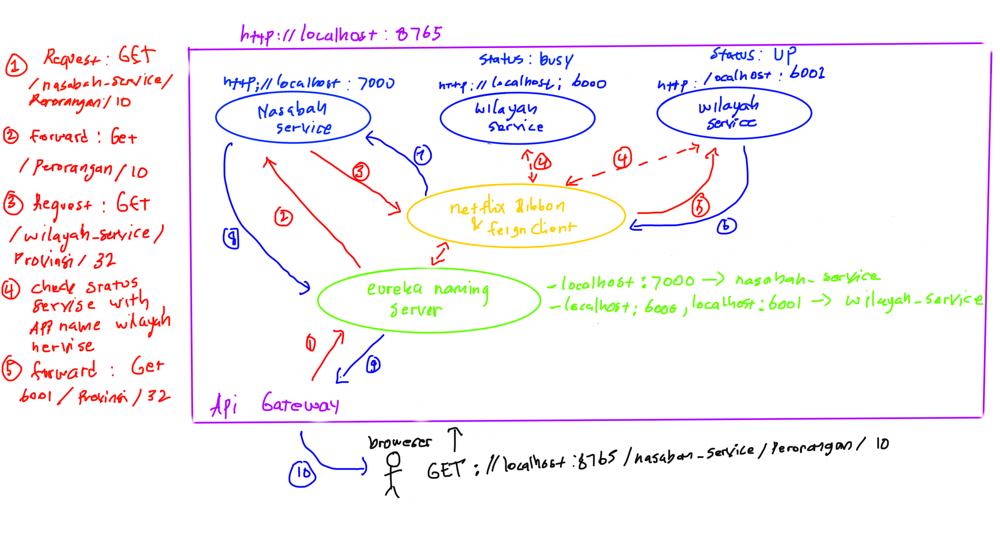

# Spring Cloud Example

Belajar spring-cloud for microservice architecture.

## Architecture `spring-cloud`



**Configuring runtime**

|   application name    | the ports binding                                         |
| :--------             | :-------                                                  |
| config-server         | [localhost:8888](http://localhost:8888)                   |
| sample-service        | [localhost:8080](http://localhost:8080)                   |
| wilayah-service       | [localhost:7000,7001...](http://localhost:6000)           |
| nasabah-service       | [localhost:6000,6001,6002...](http://localhost:6000)      |
| eureka-naming-server  | [localhost:8671](http://localhost:8671)                   |
| zuul api-gateway      | [localhost:8765](http://localhost:8765)

## Proxy with feign & ribbon

Berikut flow proxy dari service nasabah ke service wilayah: 



Biasya kalau kita call rest-api harus menanamkan url contohnya `http://localhost:8080/api/**` atau lain-lain. Nah itu hanya bekerja klo untuk satu service aja kalo ada ratusan service ??? how we can do that?

Dengan menggunakan fitur `spring-cloud-starter-netflix-eureka-server` kita bisa membuat proxy dengan multiple instance, kemudian untuk memanggil rest dengan menggunakan `spring-cloud-starter-openfeign`, `spring-cloud-starter-netflix-ribbon` dan `spring-cloud-starter-netflix-eureka-client` kita tidak perlu meng-hardcode lagi url tetapi hanya dengan menggunakan memanggilnya melalu ${spring.application.name} contoh implementasi di nasabah service seperti berikut:

```java
@FeignClient(name = "wilayah-service")
@RibbonClient("wilayah-service")
public interface WilayahProxy {

    @GetMapping("/provinsi/{id}")
    ResponseEntity<Provinsi> provinsiById(@PathVariable("id") Long provinsiId);
}
```

Akan secara langsung di forward ke service wilayah.

## Api gateway with `netflix-zuul`

Berikut ini flow api gateway:

